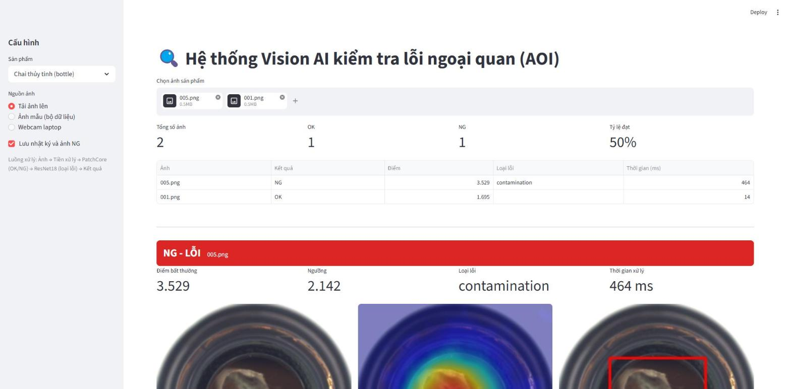

# Hệ thống Vision AI kiểm tra lỗi ngoại quan sản phẩm (AOI)

Đề tài thực tập chuyên ngành: xây dựng hệ thống kiểm tra ngoại quan tự động (AOI, *Automated Optical Inspection*). Hệ thống nhận ảnh sản phẩm, dùng AI phát hiện lỗi, khoanh vùng lỗi, phân loại loại lỗi và đưa ra kết quả **OK/NG**.



## Kết quả chính

Đánh giá trên 300 ảnh mô hình chưa từng thấy, thuộc 5 loại sản phẩm của bộ dữ liệu MVTec AD:

| Chỉ tiêu | Kết quả trung bình |
|---|---|
| Độ chính xác OK/NG (Accuracy) | **95,5%** |
| Tỷ lệ phát hiện lỗi | **95,3%** |
| Tỷ lệ báo lỗi nhầm | **3,8%** (0% ở 4/5 sản phẩm) |
| AUROC mức ảnh / mức pixel | **0,986 / 0,983** |
| Độ chính xác phân loại loại lỗi | **72,5%** |
| Thời gian xử lý | **~47 ms/ảnh** (GPU RTX 5060) |

Chi tiết từng sản phẩm: [docs/05_danh_gia_ket_qua.md](docs/05_danh_gia_ket_qua.md) và [results/summary.md](results/summary.md).

## Cách hoạt động

```
Ảnh (tải lên / webcam) → Tiền xử lý → PatchCore: OK/NG + bản đồ vùng lỗi → ResNet18: loại lỗi → Kết quả + nhật ký
```

- **PatchCore** chỉ cần ảnh sản phẩm tốt để học, phát hiện được cả lỗi chưa từng gặp.
- **ResNet18** phân loại loại lỗi trên vùng cắt quanh lỗi mà PatchCore tìm ra.
- **Dữ liệu** MVTec AD có sẵn nhãn (OK/NG, loại lỗi, mask), **không gán nhãn thủ công**.

## Cài đặt

Yêu cầu Python 3.10+. Nên có GPU NVIDIA; nếu không, hệ thống vẫn chạy trên CPU nhưng chậm hơn.

```bash
git clone https://github.com/huynhpham13790-rgb/AOI.git
cd AOI
# Cài PyTorch theo https://pytorch.org (chọn bản CUDA nếu có GPU), sau đó:
pip install -r requirements.txt
```

## Sử dụng

```bash
# 1. Tải dữ liệu (5 sản phẩm, ~1,5 GB)
python scripts/download_mvtec.py

# 2. Huấn luyện (~2 phút trên GPU cho cả 5 sản phẩm)
python scripts/train.py

# 3. Đánh giá, sinh bảng và hình vào results/
python scripts/evaluate.py

# 4. Mở giao diện demo tại http://localhost:8501
streamlit run app.py

# Hoặc kiểm tra ảnh bằng dòng lệnh
python scripts/inspect_images.py --category bottle duong_dan/anh.png
```

Trên giao diện: chọn sản phẩm, rồi **tải ảnh lên** (thay cho camera), dùng **ảnh mẫu** từ bộ dữ liệu, hoặc chụp bằng **webcam laptop**. Kết quả OK/NG hiện kèm bản đồ nhiệt, khung khoanh vùng lỗi, loại lỗi và thời gian xử lý. Nhật ký lưu ở `logs/`.

> Mô hình học từ ảnh MVTec AD chụp trong điều kiện chuẩn. Để thử, nên dùng ảnh trong `data/mvtec_ad/<sản phẩm>/test/`. Ảnh chụp tùy ý (khác nền, ánh sáng) sẽ dễ bị báo NG.

## Cấu trúc thư mục

```
AOI/
├── app.py                    # Giao diện web Streamlit
├── aoi/                      # Thư viện chính
│   ├── config.py             # Cấu hình, đường dẫn, tham số
│   ├── data.py               # Đọc dữ liệu, tiền xử lý, vẽ bản đồ nhiệt/khung lỗi
│   ├── patchcore.py          # Mô hình PatchCore (phát hiện + khoanh vùng lỗi)
│   ├── classifier.py         # ResNet18 phân loại loại lỗi
│   └── inspector.py          # Pipeline hoàn chỉnh ảnh → OK/NG
├── scripts/
│   ├── download_mvtec.py     # Tải dữ liệu
│   ├── train.py              # Huấn luyện
│   ├── evaluate.py           # Đánh giá
│   └── inspect_images.py     # Kiểm tra ảnh bằng dòng lệnh
├── docs/                     # Tài liệu (báo cáo)
├── results/                  # Kết quả đánh giá: bảng, hình
├── data/                     # (tự tạo khi tải) dữ liệu MVTec AD
├── models/                   # (tự tạo khi huấn luyện) trọng số mô hình
└── logs/                     # (tự tạo khi chạy) nhật ký kiểm tra, ảnh NG
```

## Tài liệu

1. [Tổng quan Vision AI và AOI](docs/01_tong_quan_aoi_vision_ai.md)
2. [Dữ liệu](docs/02_du_lieu.md)
3. [Mô hình AI](docs/03_mo_hinh.md)
4. [Hệ thống kiểm tra tự động](docs/04_he_thong.md)
5. [Đánh giá kết quả và hướng phát triển](docs/05_danh_gia_ket_qua.md)

## Đối chiếu với đề cương

| Kết quả dự kiến (đề cương) | Đã thực hiện |
|---|---|
| Nắm được kiến thức cơ bản về Vision AI và hệ thống AOI | [docs/01](docs/01_tong_quan_aoi_vision_ai.md) |
| Xây dựng được bộ dữ liệu hình ảnh sản phẩm | 5 sản phẩm, 1.359 ảnh huấn luyện OK + 600 ảnh test; script tải và chia dữ liệu ([docs/02](docs/02_du_lieu.md)) |
| Huấn luyện mô hình AI có khả năng phát hiện và phân loại lỗi | PatchCore (phát hiện + khoanh vùng) và ResNet18 (phân loại loại lỗi) ([docs/03](docs/03_mo_hinh.md)) |
| Xây dựng hệ thống kiểm tra tự động và đưa ra kết quả OK/NG | Giao diện web + dòng lệnh + nhật ký ([docs/04](docs/04_he_thong.md)) |
| Kiểm tra, đánh giá và hoàn thiện mô hình AOI thử nghiệm | Accuracy, tỷ lệ phát hiện lỗi, báo nhầm, thời gian xử lý; tối ưu phân loại lỗi ([docs/05](docs/05_danh_gia_ket_qua.md)) |

| Tuần | Nội dung | Sản phẩm trong repo |
|---|---|---|
| 1 | Tìm hiểu AOI, Vision AI, khảo sát sản phẩm và các dạng lỗi | `docs/01`, `docs/02` |
| 2 | Thu thập, xử lý dữ liệu (dùng dữ liệu đã gán nhãn sẵn) | `scripts/download_mvtec.py`, `aoi/data.py` |
| 3 | Lựa chọn, xây dựng mô hình | `aoi/patchcore.py`, `aoi/classifier.py`, `docs/03` |
| 4 | Huấn luyện, đánh giá, tối ưu | `scripts/train.py`, `scripts/evaluate.py`, `docs/05` mục 5.3 |
| 5 | Tích hợp hệ thống kiểm tra tự động | `aoi/inspector.py`, `app.py`, `docs/04` |
| 6 | Đánh giá, hoàn thiện, báo cáo | `results/`, `docs/05` |

## Tham khảo

- P. Bergmann et al., *MVTec AD — A Comprehensive Real-World Dataset for Unsupervised Anomaly Detection*, CVPR 2019.
- K. Roth et al., *Towards Total Recall in Industrial Anomaly Detection* (PatchCore), CVPR 2022.
- K. He et al., *Deep Residual Learning for Image Recognition*, CVPR 2016.

Dữ liệu MVTec AD theo giấy phép CC BY-NC-SA 4.0, chỉ dùng cho mục đích học tập, phi thương mại.
