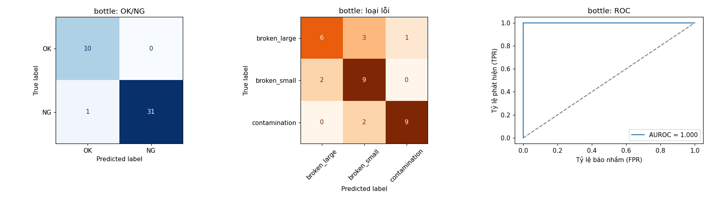
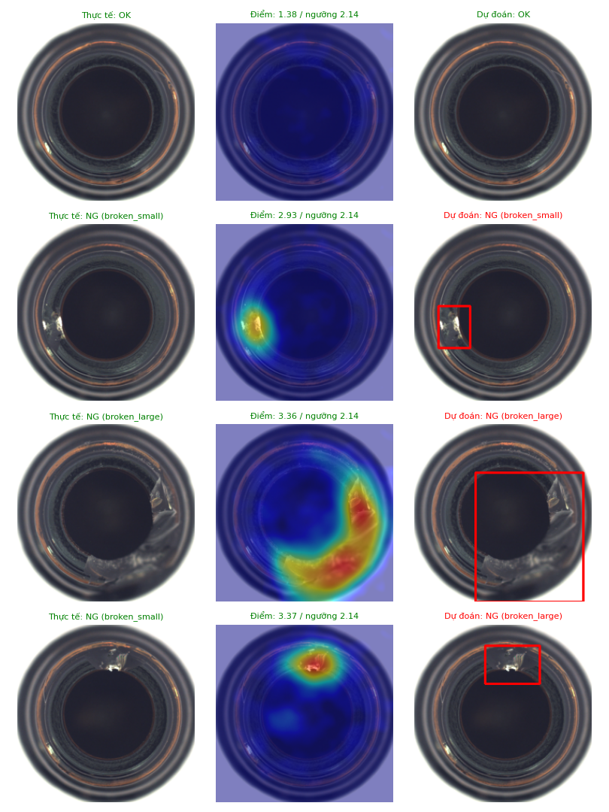

# 5. Đánh giá kết quả và hướng phát triển

## 5.1. Phương pháp đánh giá

- Đánh giá trên **nửa holdout** của tập test MVTec AD (300 ảnh: 73 OK, 227 NG). Ảnh holdout không được dùng khi huấn luyện, chọn ngưỡng hay huấn luyện bộ phân loại.
- Thời gian xử lý đo qua toàn bộ pipeline `Inspector.inspect()` (đọc ảnh → tiền xử lý → PatchCore → phân loại lỗi), trung bình trên 30 ảnh, sau khi đã khởi động GPU.
- Thiết bị: laptop, GPU NVIDIA GeForce RTX 5060 (8 GB).

Chạy lại:

```bash
python scripts/evaluate.py
```

Kết quả chi tiết (bảng, ma trận nhầm lẫn, đường ROC, ảnh minh họa) nằm trong [`results/summary.md`](../results/summary.md); số liệu thô trong [`results/metrics.json`](../results/metrics.json).

## 5.2. Kết quả

| Sản phẩm | Ảnh (OK/NG) | Accuracy | Phát hiện lỗi | Báo nhầm | Bỏ sót | AUROC ảnh | AUROC pixel | Phân loại loại lỗi | Thời gian |
|---|---|---|---|---|---|---|---|---|---|
| Chai thủy tinh | 42 (10/32) | 97,6% | 96,9% | 0,0% | 3,1% | 1,000 | 0,983 | 75,0% (3 lớp) | 46 ms |
| Viên nang | 65 (11/54) | 96,9% | 96,3% | 0,0% | 3,7% | 0,997 | 0,985 | 63,0% (5 lớp) | 53 ms |
| Hạt phỉ | 56 (20/36) | 98,2% | 97,2% | 0,0% | 2,8% | 1,000 | 0,985 | 88,9% (4 lớp) | 50 ms |
| Đai ốc kim loại | 57 (11/46) | 98,2% | 97,8% | 0,0% | 2,2% | 0,996 | 0,986 | 78,3% (4 lớp) | 48 ms |
| Ốc vít | 80 (21/59) | 86,2% | 88,1% | 19,0% | 11,9% | 0,935 | 0,975 | 57,6% (5 lớp) | 38 ms |
| **Trung bình** | **300** | **95,5%** | **95,3%** | **3,8%** | **4,7%** | **0,986** | **0,983** | **72,5%** | **47 ms** |

Thời gian huấn luyện trên GPU: PatchCore 8–27 giây, bộ phân loại 4–48 giây mỗi sản phẩm.

### Ví dụ: chai thủy tinh





Cột giữa là bản đồ nhiệt: vùng đỏ trùng với vị trí vết mẻ/vỡ thực tế dù mô hình **chưa từng thấy ảnh lỗi nào** khi học. Hình cho các sản phẩm khác nằm trong `results/figures/`.

## 5.3. Tối ưu: phân loại lỗi trên vùng cắt quanh lỗi

Phiên bản đầu đưa toàn ảnh vào ResNet18. Với lỗi nhỏ (vết xước trên viên nang, ốc vít), sau khi thu ảnh về 224×224 lỗi chỉ còn vài pixel nên mạng khó nhận ra.

Cải tiến: dùng bản đồ bất thường của PatchCore để tìm điểm lỗi rõ nhất, **cắt vùng quanh điểm đó từ ảnh gốc độ phân giải cao** (cạnh bằng 1/2 ảnh) rồi mới phân loại.

| Sản phẩm | Toàn ảnh | Vùng cắt quanh lỗi |
|---|---|---|
| Chai thủy tinh | 75,0% | 75,0% |
| Viên nang | 46,3% | **63,0%** |
| Hạt phỉ | 80,6% | **88,9%** |
| Đai ốc kim loại | 76,1% | **78,3%** |
| Ốc vít | 59,3% | 57,6% |
| **Trung bình** | 67,5% | **72,5%** |

So sánh lại: `python scripts/train.py --cls-input full` rồi `python scripts/evaluate.py` (số liệu bản toàn ảnh lưu ở `results/metrics_cls_full.json`).

## 5.4. Nhận xét

**Đạt được**
- Phát hiện OK/NG chính xác cao: 4/5 sản phẩm có accuracy ≥ 96,9%, **không báo nhầm** ảnh OK nào, AUROC ảnh ≥ 0,996.
- Khoanh vùng lỗi tốt (AUROC pixel ≈ 0,98) mà không cần mask hay ảnh lỗi khi huấn luyện.
- Tốc độ khoảng 47 ms/ảnh, tương đương khoảng 20 sản phẩm/giây, đủ cho nhiều dây chuyền thực tế.
- Huấn luyện nhanh (dưới 1 phút/sản phẩm), không cần gán nhãn thủ công.

**Hạn chế**
- **Ốc vít** khó nhất: ốc nằm ở góc xoay ngẫu nhiên, lỗi rất nhỏ ở ren và đầu ốc, ảnh xám. Tỷ lệ báo nhầm 19% và bỏ sót 11,9% là chưa đạt yêu cầu công nghiệp.
- **Phân loại loại lỗi** chỉ đạt 72,5% vì mỗi loại lỗi chỉ có khoảng 8–12 ảnh huấn luyện. Một số lỗi rất giống nhau (`broken_large`/`broken_small`, `scratch_head`/`scratch_neck`).
- Tập đánh giá nhỏ (10–21 ảnh OK mỗi sản phẩm) nên tỷ lệ báo nhầm có sai số lớn: một ảnh sai đã làm thay đổi khoảng 5–10%.
- Ảnh MVTec AD chụp trong điều kiện chuẩn (nền, ánh sáng, vị trí ổn định). Ảnh chụp tùy ý bằng điện thoại/webcam sẽ cho điểm bất thường cao do khác nền và ánh sáng. Muốn dùng cho sản phẩm thật phải chụp lại ảnh OK của chính sản phẩm đó trong điều kiện cố định rồi huấn luyện lại.

## 5.5. Hướng phát triển

1. **Phần cứng**: camera công nghiệp + đèn chiếu sáng cố định + cảm biến trigger; gửi kết quả OK/NG qua Serial/Modbus tới Arduino/PLC để gạt sản phẩm lỗi (xem [mục 4.5](04_he_thong.md#45-hướng-tích-hợp-phần-cứng-thực-tế)).
2. **Cải thiện ốc vít**: tăng độ phân giải đầu vào (320–448 px), xoay ảnh về hướng chuẩn trước khi kiểm tra, hoặc dùng mô hình mới hơn (EfficientAD, mô hình nền tảng thị giác như DINOv2).
3. **Phân loại lỗi**: tích lũy ảnh NG từ nhật ký `logs/ng_images/` để có thêm dữ liệu, hoặc chuyển sang mô hình phát hiện đối tượng (YOLO) khi đủ dữ liệu.
4. **Ngưỡng theo chi phí**: chọn ngưỡng ưu tiên giảm bỏ sót (ví dụ đạt recall ≥ 99%) thay vì tối đa F1.
5. **Triển khai**: xuất mô hình sang ONNX/TensorRT để chạy trên máy tính nhúng (Jetson) đặt cạnh dây chuyền.
