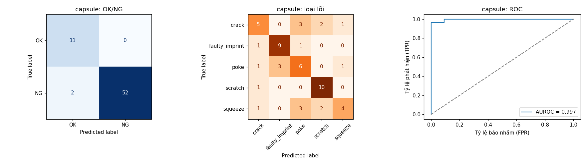
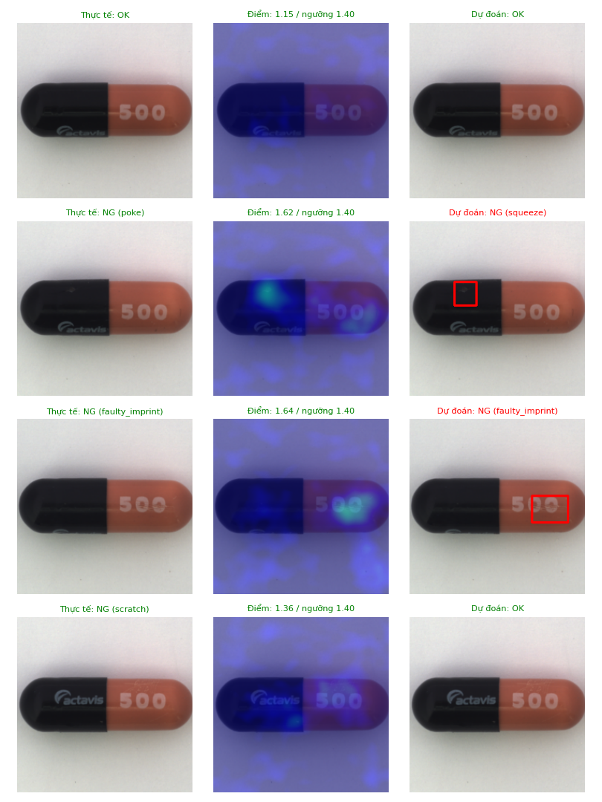
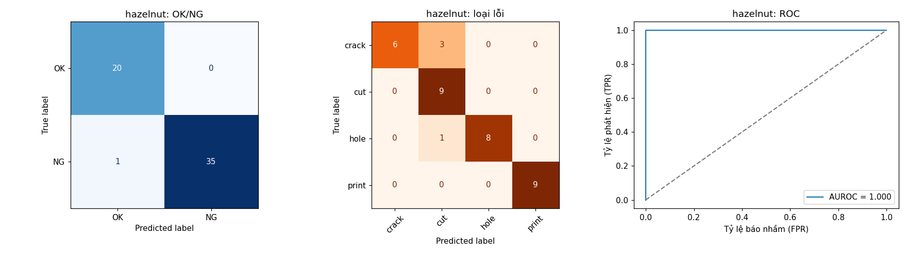
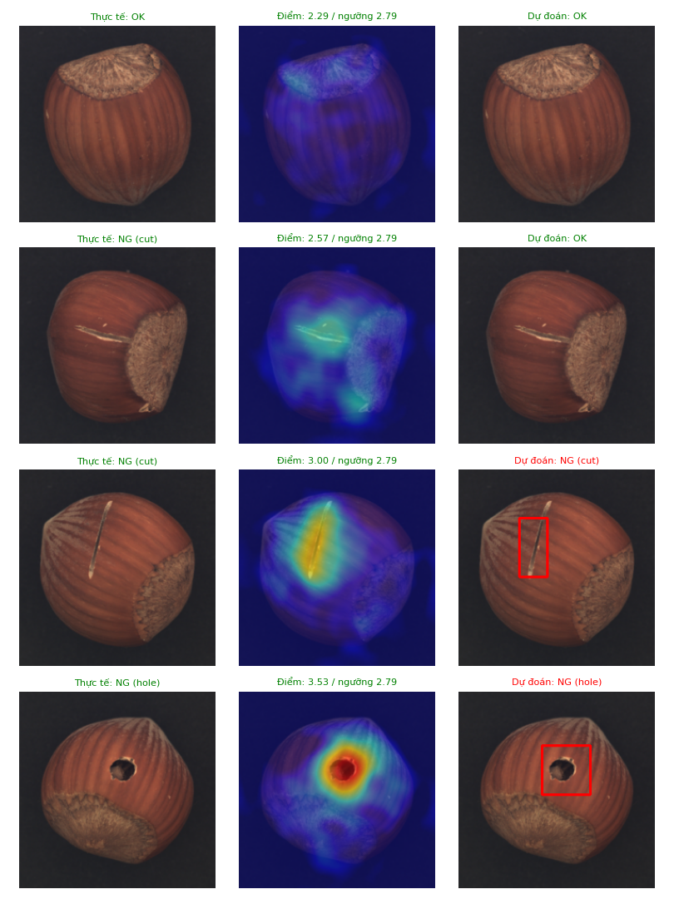
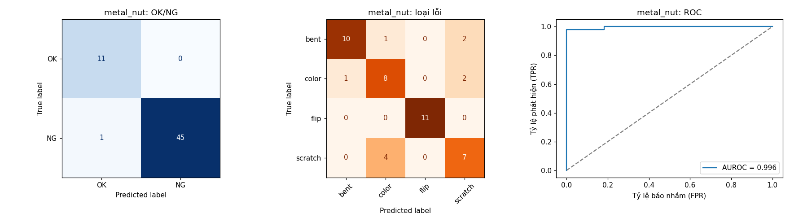
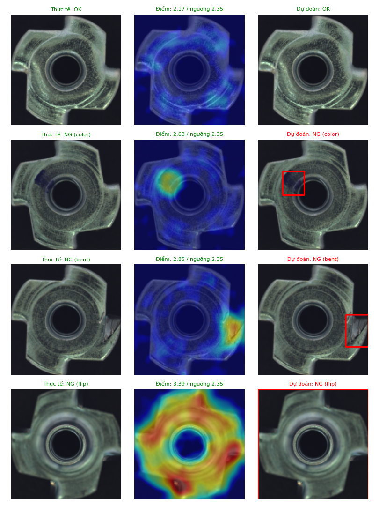
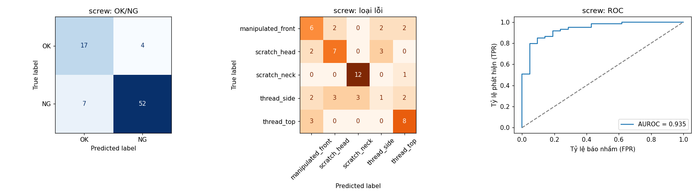
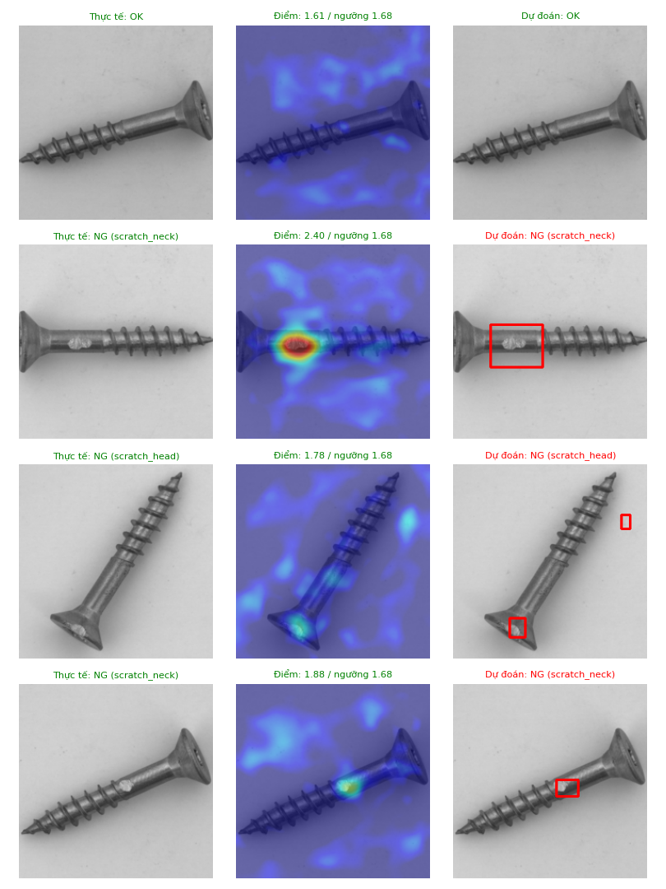

# Kết quả đánh giá

Đánh giá trên nửa holdout của tập test MVTec AD (mô hình chưa từng thấy). Thiết bị: NVIDIA GeForce RTX 5060.

| Sản phẩm | Số ảnh (OK/NG) | Accuracy | Tỷ lệ phát hiện lỗi | Tỷ lệ báo nhầm | Tỷ lệ bỏ sót | AUROC ảnh | AUROC pixel | Phân loại loại lỗi | Thời gian (ms) |
|---|---|---|---|---|---|---|---|---|---|
| Chai thủy tinh (`bottle`) | 42 (10/32) | 97.6% | 96.9% | 0.0% | 3.1% | 1.000 | 0.983 | 75.0% (3 lớp) | 46 |
| Viên nang (`capsule`) | 65 (11/54) | 96.9% | 96.3% | 0.0% | 3.7% | 0.997 | 0.985 | 63.0% (5 lớp) | 53 |
| Hạt phỉ (`hazelnut`) | 56 (20/36) | 98.2% | 97.2% | 0.0% | 2.8% | 1.000 | 0.985 | 88.9% (4 lớp) | 50 |
| Đai ốc kim loại (`metal_nut`) | 57 (11/46) | 98.2% | 97.8% | 0.0% | 2.2% | 0.996 | 0.986 | 78.3% (4 lớp) | 48 |
| Ốc vít (`screw`) | 80 (21/59) | 86.2% | 88.1% | 19.0% | 11.9% | 0.935 | 0.975 | 57.6% (5 lớp) | 38 |
| **Trung bình** | 300 | **95.5%** | **95.3%** | **3.8%** | **4.7%** | **0.986** | **0.983** | **72.5%** | **47** |

Hình chi tiết từng sản phẩm:

### Chai thủy tinh

### Viên nang

### Hạt phỉ

### Đai ốc kim loại

### Ốc vít

